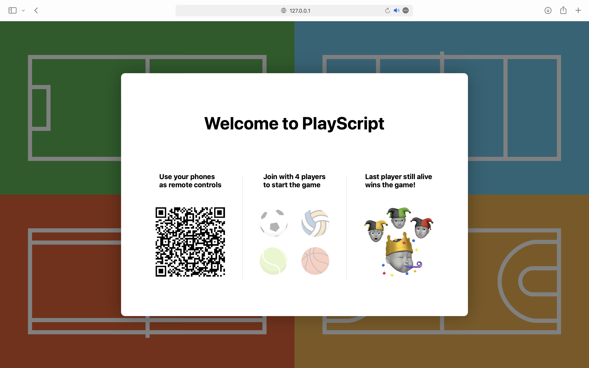
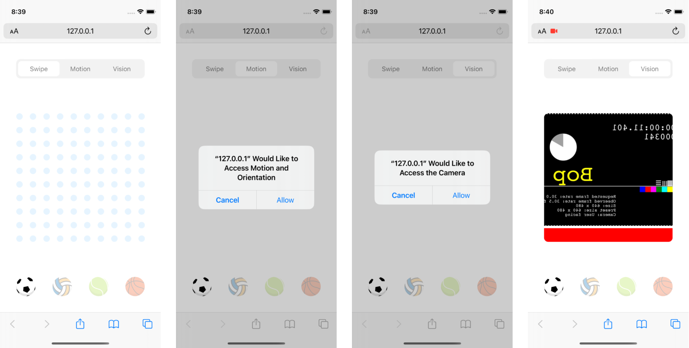

# PlayScript

## Demo

This link should be opened on a desktop computer.

https://hejthor.github.io/playscript/

## Description

As mobile and internet of things (IoT) rely on networked and distributed interactions, they introduce the challenge of concurrency and coordinating devices. This game illustrates these challenges and how they can be solved, by implementing an automated authentication model that generates QR codes and authenticates users.

As this game was developed, it became evident that coordination of concurrent interaction requires a well-structured data model and networking well, and transmission of actions rather than information or models. When information about state or an entire model is transmitted, the game fails to concurrently update every device, due to the reality of networking speed and reliability.

 

**User interfaces**

The website changes dynamically based on the device type, providing a game viewport for laptop and desktop devices, and a controller viewport for mobile and smartphone devices. It is intended that the game is displayed on a single device, and four controllers are required per game. It is possible to display the game on multiple devices by including the same authentication code in the URL, such that multiple people can view the game from different locations.

 

 

**Logic and methods**

Each component of the game was implemented through a dedicated script, providing their respective objects, methods and models. The `viewport` and `controller` facilitate interaction and reference the data and networking models. The `data model` handles QR authentication and stores the data utilised in the game. The `qtt model` handles networking and provides the methods for transmitting, receiving and processing data. The `device` script determines the device type when accessing the website.

 

**Viewport and styles**

The website consists of the structure for both its versions and the styling applied to this structure. When a device is determined to be of one type, the structure corresponding to the other type is hidden by the script. This enables the use of a single static site for a dynamic website.
